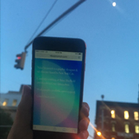

## "At times the mirror increases a thing's value, at times denies it. Not everything that seems valuable above the mirror maintains its force when mirrored. The twin cities are not equal, because nothing that exists or happens in Valdrada is symmetrical: every face and gesture is answered, from the mirror, by a face and gesture inverted, point by point. The two Valdradas live for each other, their eyes interlocked; but there is no love between them."
 
–_Invisible Cities, Italo Calvino, pg 54: Cities & Eyes_
  

#### 
 
### Introduction

So often, our eyes are glued to our phones, infinitely scrolling and being distracted by what's happening in real time. The internet and technology connect us to one another, while simultaneously distracting us from what's in front. For this assignment, I'd like you to design a mobile application to be used meaningfully in a space: so that real life and the phone work in tandem, each offering something complimentary to the other. Your mobile app should not be a mirror to what's in front of you, but rather contribute to the space in a way not possible without it.

Your app should fill in these blanks: *My destination is __. When my user is in the space, I want them to feel __ and notice __.*

### Instructions

1. Find a place that you want to make your app about. Choose wisely as you will be working with it for the rest of the semester. The place should be easily accessible to you and can be anywhere, but avoid places that already have a fully designed experience: i.e a specifically curated section of the Museum of Modern Art. Your place can be as small or as large as you want, as long as you have a way of accessing it.
2. Go to your destination and document it with field notes: photos, videos, notes, audio recordings etc. What draws you to it? What does it look like? How do you feel when you're there? What is the purpose of the space? How is it currently designed? How do you enter and exit the environment? Include a map of the location, and include key moments within it. Key moments can be anything, but should be things that made you pause, perhaps it’s a crack in the wall or maybe it’s a landmark? (Research).
3. After visiting your space, think about how technology can add to the experience. How can your mobile app contribute something meaningful to the space? While your app should be functional, think about how you can weave a narrative out of the location using design and technology. You should start to think about how to fill in these blanks: My destination is _______. When my user is in the space, I want them to feel _______ and notice ________. Also consider naming your app. (Concept)
   
#### 
 
4. Next, think about how the user navigates the physical place. How can your app be used in tandem? Start tracking the user flow of the user in both your environment and on the app. (User flow)
5. Once you’ve landed on a clear user flow, start wireframing the screens. What information does the user need? How do they access the information? Do they need to sign up, or is it accessible once you have the app? What is all the information necessary to communicate your idea? Think about how mobile specific interactions can add to your product. (Wireframing)
6. Now that you understand the logistical needs of your app, what will it look like? Start by creating 3 different visual directions for your app. They should all be focused around the same concept, but should look and feel very different. Collect your research and inspiration into a moodboard on InVision. Think about what commonalities are present in your inspiration that you can draw from. You should be able to understand your visual concept without imitating someone else’s work. (Branding)
7. Refine your branding and apply your chosen concept to a few different screens. Assess any iconography needs and add in your design.
8. Have a user test your app. Bring them to your space and document their reaction. Did they interact with the space as they intended? Did they provide any other information that you weren’t aware about?
9. Complete the design of your product. You should have about 10 screens, some of which should have interaction.
10. Pool all your research and work into a cohesive presentation. Add in design & branding guidelines.
11. Assemble either a short video introducing your app, or a 1 page website demonstrating it. Bonus points for a coded website.
  

#### 
 
### Midterm Presentation
You will present the following on October 24:
1. Concept/ideation
2. Research and analysis
3. User Description
4. User flow
5. Five wireframes, focusing on navigation and, if relevant, on boarding.
6. First pass at visual branding and iconography.
7. 3 main screens designed with interactions on InVision.

### Final Crit
You will present the following on December 12th:
1. Your app&rsquo;s evolution based on feedback.
2. User testing notes.
3. Branding and design guidelines.
4. 10 designed screens, some with interaction.
5. A video or website introducing and demonstrating the app.
